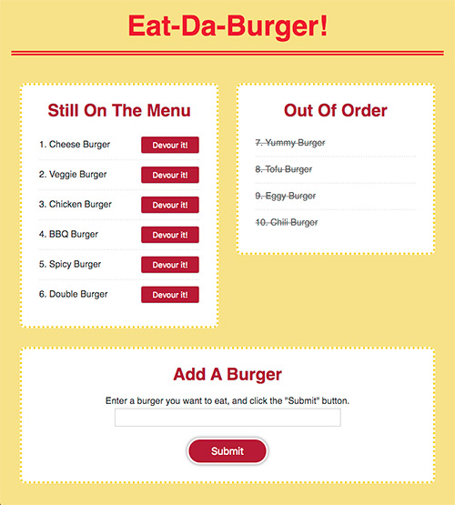

# Eat-Da-Burger

### Overview
A burger logger with MySQL, Node, Express, Handlebars and a homemade ORM.
Used Node and MySQL to query and route data in your app, and Handlebars to generate HTML.

### Links
- [Link to the page](https://yuko-burger.herokuapp.com/)
- [Link to the code](https://github.com/yuda0110/burger)

### Tech/framework used

- JavaScript
- jQuery
- Node
- [express](https://www.npmjs.com/package/express)
- [express-handlebars](https://www.npmjs.com/package/express-handlebars)
- [morgan](https://www.npmjs.com/package/morgan)
- [nodemon](https://www.npmjs.com/package/nodemon)
- [mysql](https://www.npmjs.com/package/mysql)
